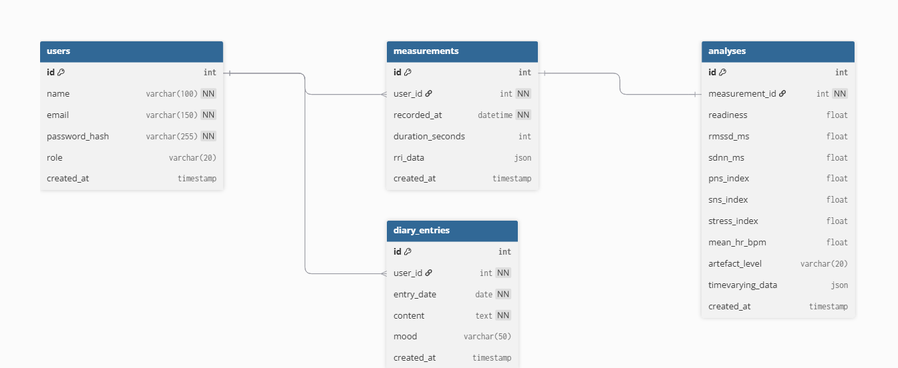

# CardioRest — Backend

HRV-pohjainen unenlaadun seurantasovellus — backend.
Metropolia Ammattikorkeakoulu | Ohjelmistotestaus | Projektiryhmä 1

---

## Projektin kuvaus

CardioRest-backend toimii välittäjänä frontendin ja Kubios Cloud -analytiikkapalvelun välillä. Se käsittelee käyttäjien kirjautumisen Kubios-tunnuksilla, hakee HRV-analyysitulokset Kubios Cloud -pilvestä ja tallentaa time-varying HRV-datan sekä päiväkirjamerkinnät omaan MariaDB-tietokantaan.

**Live-sovellus:** [cardiorest.swedencentral.cloudapp.azure.com](https://cardiorest.swedencentral.cloudapp.azure.com)

**API-dokumentaatio:** [api-dokumentaatio.html](./api-dokumentaatio.html)

---

## Teknologiat

| Teknologia | Versio | Käyttötarkoitus                   |
| ---------- | ------ | --------------------------------- |
| Node.js    | 20+    | Runtime                           |
| Express    | 4.x    | REST API -framework               |
| MariaDB    | 10.x   | Tietokanta                        |
| mysql2     | 3.x    | Tietokantayhteys                  |
| JWT        | —      | Käyttäjän autentikointi           |
| node-fetch | 3.x    | HTTP-pyynnöt Kubios Cloud API:lle |
| dotenv     | —      | Ympäristömuuttujat                |

---

## Asennus

### Vaatimukset

- Node.js 20+
- MariaDB

### Kloonaus ja asennus

```bash
git clone https://github.com/mikaemik98/cardiorest-be.git
cd cardiorest-be
npm install
```

## Tietokantarakenne



### Ympäristömuuttujat

Luo `.env` tiedosto projektin juureen:

```bash
# Palvelin
PORT=3000
JWT_SECRET=salainen_avain
JWT_EXPIRES_IN=1h

# Tietokanta
DB_HOST=localhost
DB_USER=cardiorest
DB_PASSWORD=salasana
DB_NAME=cardiorest

# Kubios Cloud API — tunnukset saadaan Kubios-tiimiltä
KUBIOS_API_URI=ks. Kubios-dokumentaatio
KUBIOS_LOGIN_URL=ks. Kubios-dokumentaatio
KUBIOS_REDIRECT_URI=ks. Kubios-dokumentaatio
KUBIOS_CLIENT_ID=ks. Kubios-tiimi
KUBIOS_USER_AGENT=cardiorest/1.0

# Kubios Analytics — time-varying HRV-analyysi
KUBIOS_USERNAME_2=kubios_kayttaja@email.fi
KUBIOS_PASSWORD_2=salasana
KUBIOS_CLIENT_ID_2=ks. Kubios-tiimi
KUBIOS_CLIENT_SECRET=ks. Kubios-tiimi
TOKEN_URL=ks. Kubios-dokumentaatio
ANALYZE_URL=ks. Kubios-dokumentaatio
KUBIOS_API_KEY=ks. Kubios-tiimi
```

### Tietokannan alustus

```bash
mysql -u root -p < schema.sql
```

### Kehityspalvelin

```bash
npm run dev
```

### Tuotanto (PM2)

```bash
pm2 start app.js --name cardiorest-be
pm2 save
```

---

## API-reitit

Täydellinen API-dokumentaatio: **[api-dokumentaatio.html](./api-dokumentaatio.html)**

### Autentikointi

| Metodi | Reitti            | Kuvaus                      |
| ------ | ----------------- | --------------------------- |
| POST   | `/api/auth/login` | Kirjaudu Kubios-tunnuksilla |

### Kubios HRV-data

| Metodi | Reitti                         | Kuvaus                                    |
| ------ | ------------------------------ | ----------------------------------------- |
| GET    | `/api/kubios/user-data`        | Hae HRV-mittaukset Kubios-pilvestä        |
| GET    | `/api/kubios/user-info`        | Hae käyttäjäprofiili Kubios-pilvestä      |
| GET    | `/api/kubios/timevarying`      | Hae time-varying HRV-data tietokannasta   |
| POST   | `/api/kubios/sync-timevarying` | Synkronoi time-varying data manuaalisesti |

### Päiväkirja

| Metodi | Reitti           | Kuvaus                   |
| ------ | ---------------- | ------------------------ |
| GET    | `/api/diary`     | Hae kaikki merkinnät     |
| POST   | `/api/diary`     | Luo uusi merkintä        |
| GET    | `/api/diary/:id` | Hae yksittäinen merkintä |
| PATCH  | `/api/diary/:id` | Päivitä merkintä         |
| DELETE | `/api/diary/:id` | Poista merkintä          |

Kaikki reitit paitsi `/api/auth/login` vaativat JWT-tokenin:

```
Authorization: Bearer <token>
```

---

## Tietokantarakenne

```sql
users
  id, name, email, password_hash, role, created_at

measurements
  id, user_id, recorded_at, duration_seconds, rri_data

analyses
  id, measurement_id, readiness, rmssd_ms, sdnn_ms,
  pns_index, sns_index, stress_index, mean_hr_bpm,
  artefact_level, timevarying_data, created_at

diary_entries
  id, user_id, entry_date, content, mood, created_at
```

---

## Time-varying HRV — toimintaperiaate

Time-varying HRV-analyysi synkronoidaan automaattisesti kun Elsi (toinen Kubios-käyttäjä) kirjautuu sovellukseen:

1. Backend kirjautuu Elsin Kubios-tunnuksilla
2. Hakee kovakoodatun yönyli mittauksen PPI-raakadatan (`TARGET_MEASURE_ID`)
3. Ajaa Kubios Analytics API:lla time-varying analyysin (60s ikkuna, 30s siirto)
4. Tallentaa tuloksen tietokantaan

> **HUOM:** `TARGET_MEASURE_ID` on tilapäinen ratkaisu — korvaa dynaamisella logiikalla jatkokehityksessä.

---

## Tunnetut ongelmat

- `TARGET_MEASURE_ID` on kovakoodattu — time-varying synkronointi hakee aina saman mittauksen
- Kubios Analytics API:lla päiväkohtainen rate limit — liian moni kirjautuminen lyhyessä ajassa johtaa 429-virheeseen
- Välimuisti estää uudelleensynkronoinnin samana päivänä (`DATE(recorded_at) = CURDATE()`)

---

## Ryhmä

| Nimi            | Vastuu                              |
| --------------- | ----------------------------------- |
| Markus Kauremaa | Backend + Tietokanta                |
| Mikael Mikkola  | Frontend + Kubios-integraatio ja UI |
| Moumen Flih     | Frontend + HRV-sivu                 |
| Daniil Pavliuk  | Backend + Termistö-sivu             |
